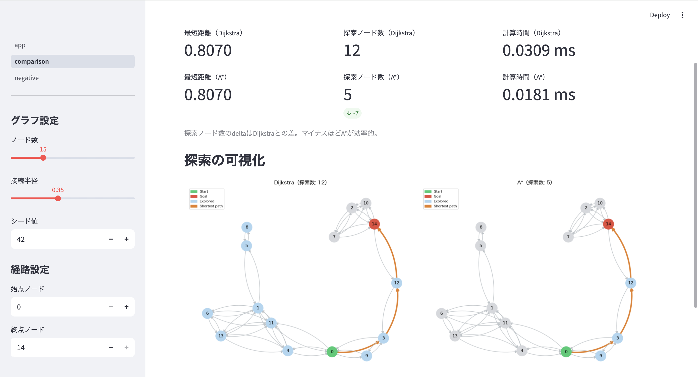

# 最短経路アルゴリズム比較（Shortest Path Optimizer）

重み付き有向グラフ上での最短経路探索をDijkstra・A*・Bellman-Fordの3手法で比較実装したポートフォリオです。

👉 **同一問題インスタンスに対して複数手法を実行し、探索ノード数・計算時間・最短経路を定量的に比較できます。**


---

## 解決できる課題

- 地図上の2点間を最短距離で結ぶ経路を求めたい
- DijkstraとA*の探索効率の違いを実際に比較したい
- 負の重みを含むグラフでの最短経路探索に対応したい
- 負閉路の存在を検出したい

---

## 想定ユースケース

- カーナビ・地図アプリの経路探索
- 配送・物流ネットワークの最短経路計算
- ゲームのパス探索
- 金融ネットワークの裁定取引検出（負閉路検出）

---

## デモ

### アプリ画面


### デモURL
Streamlit Cloud でインタラクティブデモを公開しています。  
→ **https://shortest-path-smdrgcccb5k6vhnwhhc4qh.streamlit.app/**

---

## 問題設定

重み付き有向グラフ上での2点間最短経路探索。地図上の経路探索を想定したインスタンスでデモを行います。

---

## 実装アルゴリズム

| 手法 | 対応する重み | 最適性 | 計算量 | 特徴 |
|---|---|---|---|---|
| Dijkstra | 非負のみ | ✅ | O((V+E) log V) | 高速・実用的 |
| A* | 非負のみ | ✅ | O((V+E) log V) | ヒューリスティクスで探索削減 |
| Bellman-Ford | 負の重みも可 | ✅ | O(VE) | 負閉路検出も可能 |

---

## アプリ構成

- **ページ1：Dijkstra vs A\***  
  地図風のランダムグラフ上で両手法を実行し、探索ノード数・計算時間・最短経路を比較・可視化します。ノード数・接続半径・始点・終点をUIで変更可能です。

- **ページ2：Bellman-Ford**  
  負の重みを含むグラフでDijkstraが誤った結果を返す様子と、Bellman-Fordが正しく最短経路を求める様子を並べて可視化します。負閉路の検出デモも含みます。

---

## 関連記事

- [PythonによるDijkstra法・A*の実装と探索効率の比較](https://qiita.com/Haru8-8/items/38157de604f6a638f755)
- [PythonによるBellman-Ford法の実装と負の重みへの対応](https://qiita.com/Haru8-8/items/9983409b3148417e1c87)

---

## ファイル構成

```
shortest-path/
├── app.py                    # ホーム画面（手法説明・使い分け）
├── graph_utils.py            # グラフ生成・可視化ユーティリティ
├── requirements.txt
├── pages/
│   ├── 1_comparison.py       # Dijkstra vs A* 比較
│   └── 2_negative.py         # Bellman-Ford（負の重みへの対応）
└── solvers/
    ├── dijkstra.py           # Dijkstra法
    ├── astar.py              # A*法
    └── bellman_ford.py       # Bellman-Ford法
```

---

## ローカルで実行

```bash
# 依存パッケージのインストール
pip install -r requirements.txt

# アプリの起動
streamlit run app.py
```

### 各ソルバーの単体実行

```bash
python solvers/dijkstra.py
python solvers/astar.py
python solvers/bellman_ford.py
```

---

## 技術スタック

| 分類 | 技術 |
|---|---|
| 最適化（Dijkstra・A*・Bellman-Ford） | スクラッチ実装 |
| フレームワーク | Streamlit |
| グラフ描画 | NetworkX + Matplotlib |

---

## 技術的なポイント

- **優先度付きキューによる効率化**: DijkstraとA*はPythonの`heapq`モジュールを用いた二分ヒープで実装。O(V²)の線形探索に対してO((V+E) log V)を実現
- **ユークリッド距離ヒューリスティクス**: A*のヒューリスティクスにユークリッド距離を採用。座標付きグラフでadmissible（過小評価）を保証し最適性を維持
- **早期終了**: DijkstraとA*はゴール確定時点で終了。Bellman-Fordは更新なしイテレーションで早期終了
- **負閉路検出**: Bellman-FordのV回目の緩和で更新が起きるかを確認し、負閉路の有無を判定
- **双方向辺の可視化**: NetworkXのMultiDiGraphと`connectionstyle`による曲線描画で、双方向辺を正しく表示

---

## 備考

最適化アルゴリズムの実装・比較を目的として開発したプロジェクトです。正の重みグラフにおけるDijkstra vs A*の探索効率の違いと、負の重みへの対応としてのBellman-Fordの必要性を、実装と可視化で示しています。

---

## ライセンス

[MIT License](LICENSE)